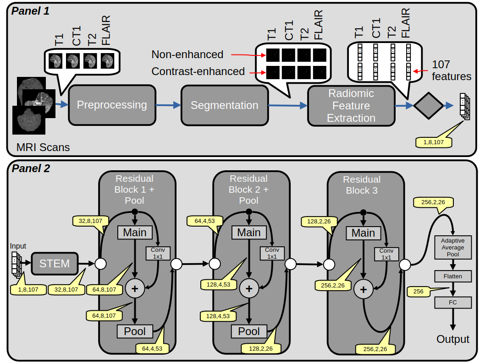

# Glioma-IDH-Deep-Radiomics
This repository implements a deep learning-based framework for the automatic classification of glioma IDH mutation status using multimodal MRI scans and radiomic feature extraction.


## Overview
The proposed pipeline integrates deep learning and radiomics to provide accurate and interpretable prediction of glioma IDH status. The method is designed to support clinical decision-making, prognosis estimation, and early risk stratification.


## Pipeline
1. MRI preprocessing (normalization, registration)
2. Automatic tumor segmentation using state-of-the-art deep learning models
3. Radiomic feature extraction (intensity, texture, shape)
4. CNN model training
5. Model evaluation




## Dataset
- **UCSF-PDGM Dataset**  
  Publicly available dataset for glioma grading
  👉 https://www.cancerimagingarchive.net/collection/ucsf-pdgm/


## Radiomic Features
Radiomic features are extracted following standardized definitions and include:
- First-order statistics
- Texture features (GLCM, GLRLM, GLSZM)
- Shape and morphological descriptors

## Model
The classification framework employs:

- Convolutional layers to extract hierarchical and local patterns from the input feature matrix
-  Residual connections to improve gradient flow and ensure stable training
-  Adaptive pooling and fully connected layers to transform learned representations into a compact embedding
-  MLP-based classifier for final binary prediction of glioma IDH status

## Requirements
- FSL 👉 https://fsl.fmrib.ox.ac.uk/fsl/docs/
- HD-BET 👉 https://github.com/MIC-DKFZ/HD-BET 
- HD-GLO-AUTO 👉 https://github.com/CCI-Bonn/HD-GLIO

Ensure all tools are correctly installed and available in your system `PATH`.


To install all the Python dependencies, run the following command:

```bash
pip install -r requirements.txt

```
## Usage

This pipeline performs MRI preprocessing, automatic tumor segmentation, and radiomic feature extraction from multimodal brain MRI data.

### Input Requirements
The input directory must contain the following NIfTI files corresponding to a single patient:

- `T1.nii.gz`
- `CT1.nii.gz` (contrast-enhanced T1)
- `T2.nii.gz`
- `FLAIR.nii.gz`

All images must be spatially aligned and stored in the same directory.

### Running the Pipeline for Preprocessing, Segmentation, and Feature Extraction
```bash
python run_pipeline.py \
  -i /path/to/input_directory \
  -o /path/to/output_directory \
  --device 0 \
  --verbose
````

- `-i` or `--input_dir`: Path to the input directory containing the input NIfTI files.
- `-o` or `--output_dir`: Path to the output directory where the results will be saved.
- `--device`: Index of the CUDA device to use (default: 0).
- `--verbose`: Print the commands before running them (default: False).


### Model Training and Evaluation on UCSF-PDGM Dataset
```bash
python cnn.py
```
Note: The model is trained  and tested using the UCSF-PDGM radiomic features extracted and stored in /data/UCSF_features.csv.


## Contact 
For questions, feedback, or collaboration opportunities, please contact:
📧 salvatore.calderaro01@unipa.it